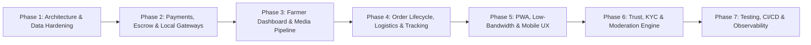

# 🌿 FarmConnect — Production & Market-Ready Engineering Roadmap

This document outlines the strategic, architectural, and technical roadmap to transition **FarmConnect** from its current functional MVP stage into an enterprise-grade, scalable, secure, and market-ready agricultural commerce platform.

---

## 📍 Current State Baseline (Where We Are Now)

- [x] **Core Marketplace UI & UX**: Responsive product grid, category filter tabs, keyword search, price/recency sorting, dark/light theme toggle.
- [x] **Authentication Engine**: Firebase Auth supporting Email/Password and Phone SMS OTP with custom user profiles.
- [x] **Listing Creation**: Farmer produce upload flow writing to Cloud Firestore with basic field validations.
- [x] **Buyer-Farmer Communication**: Direct WhatsApp deep-link generation with pre-populated produce inquiries.
- [x] **Social Proof & Reviews**: Farmer rating aggregation, buyer review modal, and Firestore review documents.
- [x] **Cart & Checkout Prototype**: LocalStorage shopping cart, checkout page summary, and Express backend scaffolding with Stripe payment session APIs.
- [x] **Basic Security**: Initial Firestore Security Rules for users, produce listings, reviews, and orders.
- [x] **Brand Assets**: Custom SVG herb favicon (`🌿`) and cohesive green color system.

---

## 🗺️ Master Strategic Roadmap Overview

---

## Phase 1: Architecture, Security & Backend Persistence Hardening
> **Objective**: Eliminate in-memory bottlenecks, synchronize orders with persistent databases, and lock down API and database security.

### 1.1 Persistent Database Layer for Backend
- [ ] **Firestore Admin SDK Integration**: Replace the in-memory `Map()` order store in `backend/server.js` with authenticated Firestore persistence (`orders` collection).
- [ ] **Atomic Transactions & Idempotency**: Implement Firestore batch writes/transactions for stock decrementing and order updates to prevent race conditions.
- [ ] **Data Model Normalization**: Refine schemas for `orders`, `order_items`, `farmers`, `buyers`, `payouts`, and `disputes`.

### 1.2 Backend Security & Middleware
- [ ] **Rate Limiting & Protection**: Configure `express-rate-limit` and `helmet` headers across all public endpoints.
- [ ] **Firebase Auth Token Verification**: Protect backend endpoints (`/api/*`) with Firebase JWT verification middleware (`verifyIdToken`).
- [ ] **CORS & Environment Configurations**: Strict origin whitelist for production (Netlify / custom domain) and robust `.env` validation using Zod or Joi.
- [ ] **Firestore Rules Hardening**: Expand `firestore.rules` to enforce strict schema validation on all fields and forbid client-side modifications of payment and order statuses.

---

## Phase 2: African Payments, Multi-Gateway & Escrow Infrastructure
> **Objective**: Enable friction-free local and international transactions tailored for agricultural trade in Nigeria and across Africa, backed by escrow safety.

### 2.1 Local & Pan-African Payment Gateways
- [ ] **Paystack Integration (Primary NGN)**:
  - Integration for Debit Cards, Bank Transfers, USSD (`*737#`, etc.), and QR codes.
  - Paystack inline popup / standard checkout flow integration on `checkout.html`.
- [ ] **Flutterwave Integration (Pan-African)**:
  - Multi-currency support (GHS, KES, ZAR, USD) and Mobile Money (M-Pesa, MoMo).
- [ ] **Stripe (International Buyers)**:
  - For diaspora and international bulk commodity buyers.

### 2.2 Agricultural Escrow & Milestone Payouts
- [ ] **Escrow State Machine**:
  - `Funds Held in Escrow` ➔ `Order Dispatched` ➔ `Produce Inspected & Verified by Buyer` ➔ `Payout Released to Farmer`.
- [ ] **Farmer Bank Account Verification**: Integrate Paystack Transfer Recipient / NUBAN resolution API to verify farmer bank accounts instantly.
- [ ] **Automated / Semi-Automated Payouts**: Secure transfer execution via Paystack Transfers upon buyer delivery confirmation or expiry window.
- [ ] **Webhook Infrastructure**: Dedicated, cryptographically verified webhook handlers (`/api/webhooks/paystack`, `/api/webhooks/stripe`) for reliable payment and refund reconciliation.

---

## Phase 3: Farmer Dashboard, Media Pipeline & Inventory Engine
> **Objective**: Give farmers full control over their inventory, pricing, direct photo uploads, and sales analytics.

### 3.1 Direct Media & Camera Upload Pipeline
- [ ] **Cloud Storage / Cloudinary Direct Upload**: Eliminate manual image URLs. Allow farmers to snap photos directly from their phone camera or select from their gallery.
- [ ] **Client-Side Image Compression**: Automatically compress high-resolution camera photos (convert to WebP, max 800px) before upload to save mobile data.

### 3.2 Farmer Self-Service Portal (`farmer-dashboard.html`)
- [ ] **Listing Management**: View active, drafted, and sold-out produce listings with one-click edit/delete/pause.
- [ ] **Inventory & MOQ Controls**: Specify Minimum Order Quantity (MOQ), available stock units (kg, 50kg bag, 100kg bag, crate, ton), and harvest dates.
- [ ] **Earnings & Settlement Tracker**: View total sales, pending escrow funds, payout history, and connected bank account details.
- [ ] **Direct Order Notifications**: SMS and in-app alerts when a new order or inquiry is placed.

---

## Phase 4: Buyer Experience, Logistics & Order Lifecycle Tracking
> **Objective**: Deliver a seamless shopping experience with real-time tracking, structured communication, and logistics estimation.

### 4.1 Enhanced Shopping & Bulk Ordering
- [ ] **Persistent & Multi-Seller Cart**: Floating cart badge, quantity increment/decrement, and grouping of cart items by farmer with per-farm subtotals.
- [ ] **Request for Quote (RFQ) / Bulk Negotiation**: For large orders (e.g., 5+ tons), allow buyers to submit quotation requests directly to farmers.
- [ ] **Location & Geolocation Filtering**: Filter produce by State, Local Government Area (LGA), or proximity distance (GPS radius).

### 4.2 Logistics & Delivery Coordination
- [ ] **Delivery Options**:
  - *Option A: Farmer-Arranged Delivery* (Flat fee or distance-based).
  - *Option B: Buyer Farm-Gate Pickup* (Coordinates and pickup directions).
  - *Option C: Third-Party Logistics (3PL)* (Integration with local dispatch & haulage services).
- [ ] **Order Tracking Portal (`track-order.html`)**: Real-time status stepper (`Order Placed` ➔ `Payment Confirmed` ➔ `Harvested / Packed` ➔ `In Transit` ➔ `Delivered`).

### 4.3 Verified Reviews & Social Trust
- [ ] **Verified Purchase Reviews**: Restrict review submissions strictly to buyers with completed, verified orders.
- [ ] **Farmer Response to Reviews**: Allow farmers to publicly reply to customer feedback.

---

## Phase 5: Progressive Web App (PWA), Offline & Low-Bandwidth Optimization
> **Objective**: Ensure lightning-fast performance in rural areas with poor connectivity (2G/3G networks) and low-end Android devices.

### 5.1 PWA & Offline Readiness
- [ ] **Web App Manifest (`manifest.json`)**: Enable "Add to Home Screen" installation on Android and iOS.
- [ ] **Service Worker & Workbox**: Cache core assets, stylesheets, icons, and recently viewed produce for offline browsing.
- [ ] **Offline Listing Drafts**: Allow farmers to compose listings offline with automatic background sync when connection is restored.

### 5.2 Performance & Asset Optimization
- [ ] **Responsive WebP/AVIF Images**: Dynamic responsive `srcset` image sizes.
- [ ] **Font & Asset Optimization**: Self-hosted or preconnected typography with zero layout shifts (CLS < 0.05).
- [ ] **Accessibility (a11y)**: Full WCAG 2.1 AA compliance, high contrast ratios, screen-reader support, and touch-target optimization (>48px).

---

## Phase 6: Trust, KYC, Admin Moderation & Multi-Language
> **Objective**: Protect against scams, ensure high produce quality, and make the platform accessible to diverse regional farming communities.

### 6.1 Farmer KYC & Verification Badges
- [ ] **Tiered Verification**:
  - *Tier 1 (Phone Verified)*: Basic listing access.
  - *Tier 2 (Identity Verified)*: NIN / Voter's Card / Government ID + Farm location proof ➔ **"Verified Farmer" 🌿 Badge**.
  - *Tier 3 (Cooperative / Commercial)*: CAC registration + physical farm audit.

### 6.2 Admin & Moderation Portal (`admin.html`)
- [ ] **Listing Moderation Queue**: Flag and review suspicious listings, fake images, or price gouging.
- [ ] **Dispute Resolution Console**: Review buyer inspection complaints, hold/release escrow funds, and issue partial/full refunds.
- [ ] **Platform Financial Overview**: Track GMV (Gross Merchandise Value), escrow balance, platform commission fees, and active users.

### 6.3 Regional Languages & Localization
- [ ] **Multi-Language Support (i18n)**:
  - English (Default)
  - Nigerian Pidgin
  - Hausa (Northern agrarian hubs)
  - Yoruba (Southwestern agrarian hubs)
  - Igbo (Southeastern agrarian hubs)

---

## Phase 7: Automated Testing, CI/CD & Production Observability
> **Objective**: Ensure rock-solid reliability, zero regressions, automated deployments, and real-time monitoring.

### 7.1 Automated Testing Suite
- [ ] **Unit Testing**: Jest / Vitest tests for utility functions, price calculations, phone number formatters, and cart operations.
- [ ] **API & Backend Integration Tests**: Supertest suite for order creation, Stripe/Paystack webhooks, and auth middleware.
- [ ] **End-to-End (E2E) Browser Tests**: Playwright / Cypress testing for the critical paths:
  - Buyer registration ➔ Produce search ➔ Cart ➔ Checkout ➔ Order confirmation.
  - Farmer registration ➔ Upload listing ➔ Manage stock.

### 7.2 CI/CD & Deployment Automation
- [ ] **GitHub Actions Pipeline**: Automated linting, test execution, and security scans on every push and pull request.
- [ ] **Staging vs. Production Environments**: Separate Firebase projects and API environments for safe feature verification.

### 7.3 Observability & Error Tracking
- [ ] **Sentry Error Monitoring**: Real-time error capture on both frontend client and backend server.
- [ ] **Uptime & Health Checks**: Pingdom / BetterStack monitors on `/health` endpoint.
- [ ] **Product & Business Analytics**: PostHog / Google Analytics 4 event tracking for drop-off analysis and farmer engagement.

---

## 📊 Summary Execution Matrix

| Phase | Milestone Focus | Primary Deliverables | Target Outcome |
| :--- | :--- | :--- | :--- |
| **Phase 1** | Architecture & Security | Firestore Admin Backend, JWT Auth, Rate Limiter, Firestore Rules | Zero in-memory loss, hardened APIs |
| **Phase 2** | Payments & Escrow | Paystack / Flutterwave, Webhooks, Escrow release mechanism | Real African market payment support |
| **Phase 3** | Farmer Operations | Direct Camera/Cloudinary upload, Farmer Dashboard, Stock control | Self-sufficient farmer experience |
| **Phase 4** | Buyer & Logistics | Enhanced Cart, Order Tracking, Delivery calculation, Verified Reviews | High-trust buyer journey |
| **Phase 5** | PWA & Low Bandwidth | Offline caching, Service Worker, WebP compression, Touch optimization | Seamless operation in rural areas |
| **Phase 6** | Trust & Moderation | Farmer KYC, Admin Dispute Portal, Regional i18n | Scalable platform governance |
| **Phase 7** | Quality & Monitoring | Unit/E2E Test suites, GitHub Actions CI/CD, Sentry error tracking | 99.9% uptime & production stability |

---

*This roadmap is a living document. We will execute items systematically from Phase 1 through Phase 7.*
